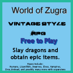
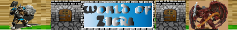

# WorldofZugra

*The world of zugra repository*

 
 
TODO:
build a graphic underlay for the pet shop.
build png files for various pets
create pet_revive.php
edit pet_adopt.php to include neccessary code to add a pet to character's data
modify database to accomodate pet adoption
define combat code for pets

Version Information:
This is a rutimentary creation of a MVP pet module to be added into the already exsisting World of Zugra online game
It aims to add in the ability for characters to adopt, raise, and battle with a pet.

